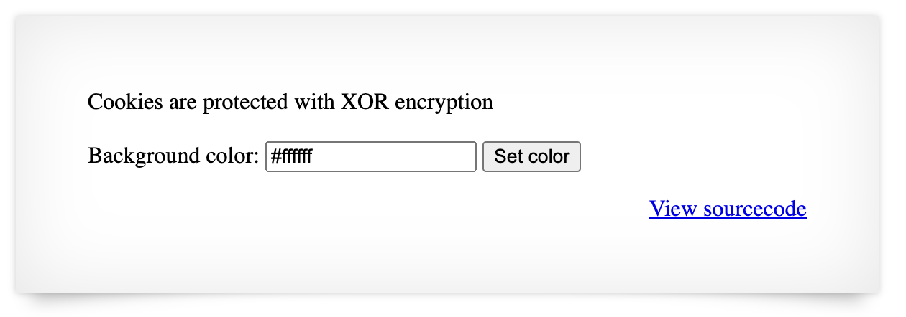

# Natas OverTheWire

## Level 0

`username: natas0`
`password: natas0`
`url: http://natas0.natas.labs.overthewire.org/`

**Solution:**
Inspect the source code. The password is in a comment.
The password is `g9D9cREhslqBKtcA2uocGHPfMZVzeFK6`.

## Level 1

`username: natas1`
`password: g9D9cREhslqBKtcA2uocGHPfMZVzeFK6`
`url: http://natas1.natas.labs.overthewire.org/`

**Solution:**
Right click has been disabled on the website. However, we can still view the source code by going to More Tools > Developer Tools. The password is in a comment.
The password is `h4ubbcXrWqsTo7GGnnUMLppXbOogfBZ7`.

## Level 2

`username: natas2`
`password: h4ubbcXrWqsTo7GGnnUMLppXbOogfBZ7`
`url: http://natas2.natas.labs.overthewire.org/`

**Solution:**
The website says 'there is nothing on this page'. Hmm... let's check the source code. There is nothing but a png file. I noticed that the png file was in a folder named 'files'. Let's go to http://natas2.natas.labs.overthewire.org/files/. There is a users.txt file.

```
username:password
alice:BYNdCesZqW
bob:jw2ueICLvT
charlie:G5vCxkVV3m
natas3:G6ctbMJ5Nb4cbFwhpMPSvxGHhQ7I6W8Q
eve:zo4mJWyNj2
mallory:9urtcpzBmH
```

The password is `G6ctbMJ5Nb4cbFwhpMPSvxGHhQ7I6W8Q`.

## Level 3

`username: natas3`
`password: G6ctbMJ5Nb4cbFwhpMPSvxGHhQ7I6W8Q`
`url: http://natas3.natas.labs.overthewire.org/`

**Solution:**
By inspecting the code, I saw a comment saying this 'No more information leaks!! Not even Google will find it this time..'.

I found out that there was a robots.txt file. The file contains the following: `User-agent: * `
`Disallow: /s3cr3t/`

Let's go to http://natas3.natas.labs.overthewire.org/s3cr3t/. There is a users.txt file.

The password is `tKOcJIbzM4lTs8hbCmzn5Zr4434fGZQm`.

## Level 4

`username: natas4`
`password: tKOcJIbzM4lTs8hbCmzn5Zr4434fGZQm`
`url: http://natas4.natas.labs.overthewire.org/`

**Solution:**
Website says the following: 'Access disallowed. You are visiting from "http://natas4.natas.labs.overthewire.org/index.php" while authorized users should come only from "http://natas5.natas.labs.overthewire.org/"'. There is a refresh button on the side.

We can use curl to change the referer.
`curl -u natas4:tKOcJIbzM4lTs8hbCmzn5Zr4434fGZQm --referer http://natas5.natas.labs.overthewire.org/ http://natas4.natas.labs.overthewire.org/`


The password is `Z0NsrtIkJoKALBCLi5eqFfcRN82Au2oD`.

## Level 5

`username: natas5`
`password: Z0NsrtIkJoKALBCLi5eqFfcRN82Au2oD`
`url: http://natas5.natas.labs.overthewire.org/`

**Solution:**
The website says 'Access disallowed. You are not logged in'. Let's check the cookies. There is a loggedin cookie. We can change the value to 1 and refresh the page. The password is put on the page.


The password is `fOIvE0MDtPTgRhqmmvvAOt2EfXR6uQgR`.

## Level 6

`username: natas6`
`password: fOIvE0MDtPTgRhqmmvvAOt2EfXR6uQgR`
`url: http://natas6.natas.labs.overthewire.org/`

**Solution:**
We need to find a secret to write into the input field. By doing this, we can find the password for the next level. Let's look at the source code. The source code shows a php file with the following code:

```
<?

include "includes/secret.inc";

    if(array_key_exists("submit", $_POST)) {
        if($secret == $_POST['secret']) {
        print "Access granted. The password for natas7 is <censored>";
    } else {
        print "Wrong secret";
    }
    }
?>
```

We can see that it includes a "includes/secret.inc". Let's try to go to this file in the URL. We can now see the secret which is `FOEIUWGHFEEUHOFUOIU`. Let's put this in the input field and submit. The password is put on the page.


The password is `jmxSiH3SP6Sonf8dv66ng8v1cIEdjXWr`.

## Level 7

`username: natas7`
`password: jmxSiH3SP6Sonf8dv66ng8v1cIEdjXWr`
`url: http://natas7.natas.labs.overthewire.org/`

**Solution:**
Looking at the source code for the home page, we see this comment: '<!-- hint: password for webuser natas8 is in /etc/natas_webpass/natas8 -->'. Let's go to http://natas7.natas.labs.overthewire.org/index.php?page=/etc/natas_webpass/natas8. The password is put on the page.

The password is `a6bZCNYwdKqN5cGP11ZdtPg0iImQQhAB`.

## Level 8

`username: natas8`
`password: a6bZCNYwdKqN5cGP11ZdtPg0iImQQhAB`
`url: http://natas8.natas.labs.overthewire.org/`

**Solution:**
We need to find a secret code to write into the input field. By looking at the source code, we see that the secret code is encoded with base64. Let's decode it.

The encodedSecret is '3d3d516343746d4d6d6c315669563362'. The decoded secret is '==QcCtmMml1ViV3b' which is a reverse Base64. Let's reverse it by writing the command: `echo '==QcCtmMml1ViV3b' | rev | base64 -d`. We get the secret code 'oubWYf2kBq'. By writing this code into the input field, we get the password for the next level.

The password is `Sda6t0vkOPkM8YeOZkAGVhFoaplvlJFd`.

## Level 9

`username: natas9`
`password: Sda6t0vkOPkM8YeOZkAGVhFoaplvlJFd`
`url: http://natas9.natas.labs.overthewire.org/`


**Solution:**
The source code says: `<?
$key = "";

if(array_key_exists("needle", $\_REQUEST)) {
$key = $\_REQUEST["needle"];
}

if($key != "") {
passthru("grep -i $key dictionary.txt");
}
?>`

We can see that the input field is used in a grep command. We can use this to execute commands. Let's try to execute the command `; cat /etc/natas_webpass/natas10;`. The password is put on the page.

The password is `D44EcsFkLxPIkAAKLosx8z3hxX1Z4MCE`.

## Level 10

`username: natas10`
`password: D44EcsFkLxPIkAAKLosx8z3hxX1Z4MCE`
`url: http://natas10.natas.labs.overthewire.org/`

**Solution:**
The website says: 'For security reasons, we now filter on certain characters'.

The source code says: `<?
$key = "";

if(array_key_exists("needle", $\_REQUEST)) {
$key = $\_REQUEST["needle"];
}

if($key != "") {
    if(preg_match('/[;|&]/',$key)) {
print "Input contains an illegal character!";
} else {
passthru("grep -i $key dictionary.txt");
}
}
?>`

Since we can't use `;|& ` when typing our command, we need to find another way to execute commands. Grep can use wildcards, and I have noticed that the dictionary.txt is very big, so we can exclude it by typing the command `.* /etc/natas_webpass/natas11`.


The password is `1KFqoJXi6hRaPluAmk8ESDW4fSysRoIg`.

## Level 11

`username: natas11`
`password: 1KFqoJXi6hRaPluAmk8ESDW4fSysRoIg`
`url: http://natas11.natas.labs.overthewire.org/`



**Solution:**
The source code says: `<?

$defaultdata = array( "showpassword"=>"no", "bgcolor"=>"#ffffff");

function xor_encrypt($in) {
$key = '<censored>';
$text = $in;
$outText = '';

    // Iterate through each character
    for($i=0;$i<strlen($text);$i++) {
    $outText .= $text[$i] ^ $key[$i % strlen($key)];
    }

    return $outText;

}

function loadData($def) {
    global $_COOKIE;
    $mydata = $def;
    if(array_key_exists("data", $_COOKIE)) {
    $tempdata = json_decode(xor_encrypt(base64_decode($\_COOKIE["data"])), true);
if(is_array($tempdata) && array_key_exists("showpassword", $tempdata) && array_key_exists("bgcolor", $tempdata)) {
        if (preg_match('/^#(?:[a-f\d]{6})$/i', $tempdata['bgcolor'])) {
$mydata['showpassword'] = $tempdata['showpassword'];
$mydata['bgcolor'] = $tempdata['bgcolor'];
}
}
}
return $mydata;
}

function saveData($d) {
    setcookie("data", base64_encode(xor_encrypt(json_encode($d))));
}

$data = loadData($defaultdata);

if(array_key_exists("bgcolor",$_REQUEST)) {
    if (preg_match('/^#(?:[a-f\d]{6})$/i', $\_REQUEST['bgcolor'])) {
$data['bgcolor'] = $\_REQUEST['bgcolor'];
}
}

saveData($data);

?>`

We can see that the cookie is encrypted with xor_encrypt. We can use this to decrypt the cookie. Let's write a script to decrypt the cookie.

```python
import base64

def xor_encrypt(text, key):
    outText = ''
    for i in range(len(text)):
        outText += chr(ord(text[i]) ^ ord(key[i % len(key)]))
    return outText

```

Decoding 'MGw7JCQ5OC04PT8jOSpqdmkgJ25nbCorKCEkIzlscm5oKC4qLSgubjY%3D'. The decoded cookie is '{"showpassword":"no","bgcolor":"#ffffff"}'. We can change the showpassword to yes and encode it again. The encoded cookie is 'MGw7JCQ5OC04PT8jOSpqdmkgJ25nbCorKCEkIzlscm5oKC4qLSgubjY%3D'. Let's change the cookie to the encoded cookie and refresh the page.
